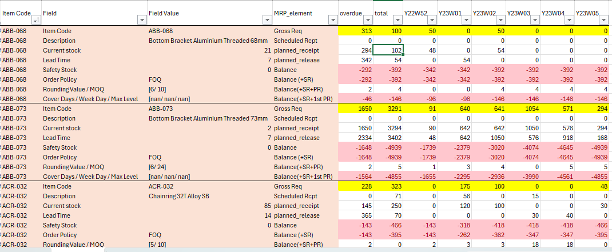
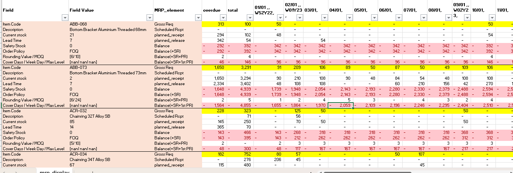
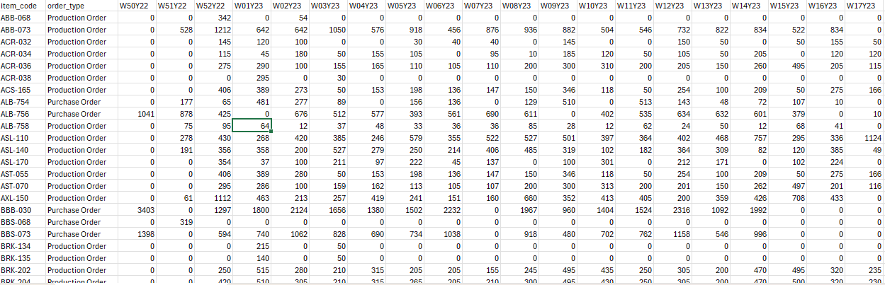
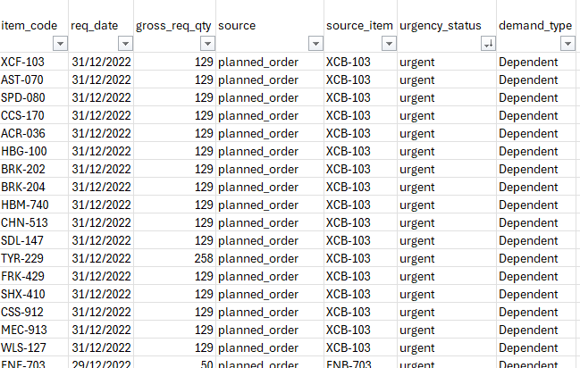

# MRP Planning System

*A comprehensive Python-based Material Requirements Planning (MRP) system designed to calculate material requirements, plan production schedules, and generate order recommendations for manufacturing operations.*

**Features**

- **Comprehensive MRP Calculation**: *Implements full MRP logic including net requirements calculation, lot sizing, and planned order generation*
- **Flexible Procurement Policies**: *Supports multiple procurement types (RAW, ASSEMBLY, FNG) and ordering policies (L4L, FOQ, WEEKLY_CALENDAR, COVER_DAYS, MIN_MAX)*
- **Multi-level BOM Support**: *Handles complex bill-of-materials with dependent demand calculations*
- **Time-phased Planning**: *Supports daily and weekly planning horizons with configurable lead times*
- **Safety Stock Management**: *Configurable safety stock levels for inventory management*
- **Data Validation**: *Robust input validation and error handling*
- **Report Generation**: *Multiple output formats including CSV reports and display tables*

## Table of Contents


- [Requirement and Installation](#requirement-and-installation)
- [How to use](#how-to-use)
- [Input](#input)
- [Output](#output)
- [Architecture](#architecture)


## Requirement and Installation

**Requirement**

- Python 3.8 or higher
- pandas
- numpy
- datetime (standard library)

**Installation**
1. Clone the repository:
   ```bash
   git clone <repository-url>
   cd MRP_project_taiduc
   ```

2. Create a virtual environment (recommended):
   ```bash
   python -m venv venv
   source venv/bin/activate  # On Windows: venv\Scripts\activate
   ```

3. Install dependencies:
   ```bash
   pip install pandas numpy
   ```

4. Ensure data files are placed in the correct directories (see [Input](#input))


## How to use

1. Ensure all input data files are present in `data/from_PS/` and in correct name, order (see [Project Structure](#project-structure))
2. Run the main script:
   ```bash
   python main_script.py
   ```


The system generates several output files in `output/`:
- `mrp_display.csv`: Formatted MRP results for each item
- `full_demand.csv`: Complete demand requirements
- `order_recommendation_report_*.csv`: Order recommendations for purchasing and production


Note: Modify `config.py` to adjust:
- Planning horizons
- Default policies
- File paths
- Procurement parameters
(see [Configuration](#configuration))


## Output

The system generates timestamped output directories containing:

- **MRP Display**: Detailed MRP calculations for each item 
- **Full Demand**: Consolidated demand requirements (from independent demand like sub-assembly)
- **Order Recommendations**: Orders suggestions for production and purchasing
  - Raw planned orderr
  - Urgent requirements
  - Weekly planned orders


**MRP Display** : 
- NOTE: you can choose **date view** or **week view** in `config.py`

Week view:



Date view:




**Order Recommendation**:

Weekly Summary:



**Full Demand** :
   - column `source_item` : parent item of that item (eg: finished product of a raw material)
   - column `source` : is that item from Sales Order , Supply Order *(scheduled_receipt)*, MRP calculation process *(planned_order)*



## Input
The dataset is placed the following files in `data/from_PS/`
This is the input of the Planning System. I use 6 core datasets from 2 groups:
- **master** (item_master, bom_master, policy_master) : 
   - **Static reference data** that defines the product structure, item attributes, and planning rules 
   - these are relatively stable and define the "what" and "how" of the planning system
- **transaction** (demand_orders, supply_orders, onhand): 
   - **Dynamic operational data** representing current business activities 
   - these change frequently and drive the planning calculations

- for more details:


| Name | File Name | Description | Schema |
|------|-----------|-------------|--------|
| Item Master | item_master.txt | Contains item definitions with descriptions, units of measure, vendors, and categories | ["item_code", "desc", "uom", "vendor", "category"] |
| Bill of Materials | bom_master.txt | Defines parent-child relationships in the product structure with component quantities required per parent | ["parent", "component", "qty_per"] |
| Policy Master | policy_master.txt | Planning policies and parameters for each item including lead times, safety stock, and ordering rules | ["item_code", "procurement_type", "policy_name", "lead_time", "safety_stock", "rounding_value", "MOQ", "cover_days", "week_day", "max_level"] |
| Demand Orders | demand_orders.txt | Customer demand data showing required quantities by date | ["item_code", "qty", "date"] |
| Supply Orders | supply_orders.txt | Scheduled receipts and incoming supply information | ["item_code", "qty", "date"] |
| On-hand Inventory | onhand.txt | Current inventory levels for each item | ["item_code", "date", "qty"] |

Note: Make sure the schema of each table is correct (column name and order)


## Architecture
Note: For those who want to understand the system logic
The system follows a modular architecture with clear separation of responsibilities:
- [Core Components](#core-components)
- [Data Flow](#data-flow)
- [Key Algorithm](#key-algorithm)
- [Configuration](#configuration)
- [Project Structure](#project-structure)

### Core Components

- `run.py`: run MRP logic
- `config.py`: Centralized configuration management for paths, policies, and system parameters
- `src/`: Utility modules containing core business logic
  - `task_mrp.py`: MRP computation algorithms and data structures
  - `task_display.py`: Output formatting and report generation
  - `helper.py`: General utility functions for data processing and calculations
  - `mrp_engine`: Main entry point orchestrating the MRP computation process


### Data Flow

1. **Input Processing**: Raw data files are loaded and validated
2. **Data Preparation**: Input data is transformed into computation-ready format
3. **MRP Computation**: Core MRP algorithm processes each item through:
   - Net requirements calculation
   - Lot sizing based on procurement policies
   - Planned order generation with lead time considerations
4. **Output Generation**: Results are formatted and saved to various output files

### Key Algorithms
- **Net Requirements Calculation**: Determines actual material needs after accounting for inventory and scheduled receipts
- **Lot Sizing**: Applies procurement policies to determine optimal order quantities
- **Lead Time Scheduling**: Backward scheduling from requirement dates
- **Dependent Demand Explosion**: Multi-level BOM processing for component requirements


### Configuration

The system is configured through `config.py`. Key configuration options include:

**Environment Settings**
- `TODAY`: Base date for planning calculations
- `PATH_MASTER`: Path to master data files
- `PATH_TRANSACTION`: Path to transaction data files
- `PATH_OUTPUT`: Output directory for results

**MRP Parameters**
- `HORIZON_MODE_CHOICE`: Planning horizon mode ("Daily" or "Weekly")
- `HORIZON_DEFAULT_DAYS`: Default planning horizon in days
- `DEFAULT_POLICY`: Default procurement policy settings

**Procurement Policies**
Supported policies include:
- **L4L** (Lot-for-Lot): Order exact requirements
- **FOQ** (Fixed Order Quantity): Fixed order sizes
- **WEEKLY_CALENDAR**: Weekly ordering cycles
- **COVER_DAYS**: Coverage-based ordering
- **MIN_MAX**: Min-max inventory 


### Project Structure


```text
├── run.py
├── README.md
├── config.py
├── data
│   ├── from_PS
│   │   ├── bom_master.txt
│   │   ├── demand_orders.txt
│   │   ├── item_master.txt
│   │   ├── onhand.txt
│   │   ├── policy_master.txt
│   │   └── supply_orders.txt
│   ├── master
│   │   ├── bom_master.csv
│   │   ├── item_master.csv
│   │   └── policy_master.csv
│   └── transaction
│       ├── demand_orders.csv
│       ├── onhand.csv
│       └── supply_orders.csv
├── output
│   ├── 2026-03-17_10-49-36
│   │   ├── full_demand.csv
│   │   ├── mrp_display.csv
│   │   ├── order_recommendation_report_raw_planned_df.csv
│   │   ├── order_recommendation_report_urgent_report_df.csv
│   │   └── order_recommendation_report_weekly_planned_df.csv
├── src
│   ├── directory_tree.py
│   ├── helper.py
│   ├── mrp_engine.py
│   ├── task_display.py
│   └── task_mrp.py
```
